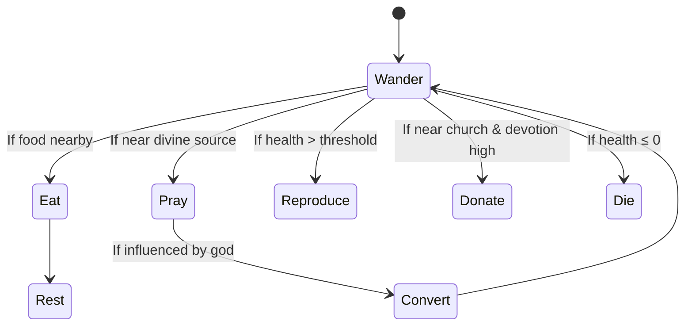

# **How to test**

## **1. Install Ollama**

**TBD** 

## **2. Install Vercel**

**Vercel** allows serverless local deployment:
**npm install -g vercel**

set project root and call:
**vercel dev**
/* more infos on settings incoming */

It creates a server on http://localhost:3000 and servers automatically **index.html**, while activating LLMs API routes.
It needs no dependencies installed.


--------------------


# **Overview**
**Origins** is a generative life simulation built in **JavaScript** and **Three.js**.  
The project was developed for **ICA 25**, a creative coding course in the **Mathcastles Discord**, and explores themes of emergence, belief, biology, and systemic complexity in autonomous agent-based systems.

---


# **Origins**

## **Overview**
**Origins** is a generative life simulation built in **JavaScript** and **Three.js**.  
The project was developed for **ICA 25**, a creative coding course in the **Mathcastles Discord**, and explores themes of emergence, belief, biology, and systemic complexity in autonomous agent-based systems.

---

## **Concept**
In *Origins*, autonomous digital creatures evolve over time within a simulated 3D world.  
These creatures can move, eat, reproduce, form beliefs, and eventually die.  
The simulation unfolds without direct player control, encouraging observation and reflection on how complex behaviors emerge from simple rules.

Each creature has its own:

- **Physical needs** (health, hunger, breed capability)  
- **Cognitive attributes** (devotion, susceptibility to belief)  
- **Faith dynamics** (interacting with gods and churches)  
- **Reproductive logic** (health + religion-based influence)

---

## **MVP Mechanics: Faith, Biology, Survival**

### **Core Entities**

#### **Creature Attributes**

| **Attribute** | **Description** |
|----------------|-----------------|
| **Health** | Randomized at creation. Boosted via consumption or church effects. Can be donated to build churches. |
| **Devotion** | Determines resistance/susceptibility to adopting a religion. After two rejections, must convert. |
| **Sex** | Randomized at birth (not necessarily 50/50). |
| **Breed Capability** | Reproductive capacity, influenced by health and religious adherence. |
| **Faith** | Initially agnostic. Converts to a god after repeated exposure or divine influence. |

---

### **Creature Actions**

- **Adopt Religion:** After 2 refusals, entity must convert to a religion.  
- **Donate Health / Build Church:** Devotion determines whether a creature contributes health to a church.  
- **Consume:** Eat food to regain health.  
- **Breed:** Reproduce with sufficient health and partner compatibility.  
- **Fight (Not in MVP):** Will be triggered by overpopulation dynamics in future versions.

---

## **Religion & Churches**

### **Gods (Faith Archetypes)**

| **God Type** | **Health Bonus** | **Breed Penalty** |
|---------------|------------------|-------------------|
| **Wary God** | +10% Health | -15% Breed |
| **Balanced God** | ±0% | ±0% |
| **Peaceful God** | +10% Breed | -15% Health |

---

### **Churches**
Churches are communal structures built by health donations.  
They amplify the religion’s effects and boost creature health at a given location.

| **Church Level** | **Health Boost** |
|-------------------|------------------|
| **LVL 1** | +5% |
| **LVL 2** | +10% |
| **LVL 3** | +15% |

Churches are created when cumulative donated health reaches certain thresholds.  
Only 3 levels exist, increasing health benefits to nearby believers.  
Churches are tied to the god's influence radius and affect nearby converts.

---

## **Core Simulation Loop**



---
## **Player Interaction**

While *Origins* is primarily an observer-driven simulation, players have minimal interactive tools to experiment with environmental dynamics:

| **Action** | **Description** |
|-------------|-----------------|
| **Left Click** | Place food or hazard |
| **Spacebar** | Toggle between food and hazard |
| **Cooldown** | 2 seconds between spawns (max 5 active objects) |

---

## **System Architecture**

### **Core Components**

| **Component** | **Description** |
|----------------|-----------------|
| **Creatures** | Simulated agents with evolving behavior and belief |
| **World** | Bounded 2D/3D space using physics & graphics |
| **Churches** | Religious centers built through communal donation |
| **Divine Radius** | Zone of religious influence tied to each god |
| **Player Layer** | Optional layer for interaction (food/hazard drops) |

---

## **Behavior & Energy Models**

### **Energy Depletion**

**Formula:**  
`E(t + Δt) = E(t) - 0.10Δt - 0.12vΔt + f_eat - f_pray`

- **Drain:** 0.10/sec base + velocity-based tax  
- **Eating:** +25 energy  
- **Praying:** -5 energy  
- **Death:** occurs if energy ≤ 0

---

### **Faith Conversion Model**

**Equations:**
`λ = β × I × (1 - r/R) × (1 - d)`
`P(convert) = 1 - exp(-λ × Δt)`


**Parameters:**
- **β:** Base rate of conversion  
- **I:** Intensity of divine presence  
- **r:** Distance to divine source  
- **R:** Max radius of god’s influence  
- **d:** Creature’s existing devotion  

---

## **Technical Stack**

- **JavaScript (ES6)** — Simulation logic  
- **Three.js** — 3D rendering  
- **Cannon-ES** — Physics engine  
- **PHP** — Optional backend for LLM integrations  
- **HTML/CSS** — UI layer  

---

## **Project Structure**

```
origins/
├── frontend/
│   ├── index.html
│   ├── js/
│   │   ├── world.js
│   │   ├── creatures.js
│   │   ├── churches.js
│   │   └── ui.js
│   └── css/
│       └── style.css
├── backend/
│   ├── (Optional PHP for LLM/god logic)
├── assets/
│   ├── models/
│   └── textures/
└── README.md
```


---

## **Artistic Context**

This simulation was inspired by **generative art**, **agent-based modeling**, and **religious anthropology**.  
It explores how faith emerges, how biological systems evolve, and how simple rules create complex behaviors.  
*Origins* blends simulation aesthetics with game logic and spiritual metaphors—tapping into what it means to believe, to survive, and to contribute.

---

## **Contributors**

| **Name** | **Role** |
|-----------|-----------|
| **PlayPeng** | Team Lead, LLM Integration |
| **Cyclez** | Systems Design, Game Logic |
| **Patti** | Art, Visual Design |
| **JJoy** | LLM Integration, Visuals |
| **RaulOnAStool** | Systems Design, Simulation Mechanics |

---

## **License**

Released under **CC BY-NC 4.0**.  
Feel free to remix and reuse non-commercially with proper attribution.

---

## **Acknowledgments**

Created for **ICA 25: Art & Computation**  
Guided by **@0x113d** and the **Mathcastles community**  
Thank you to the **ICA 25 cohort** for the inspiration, chaos, and feedback.
